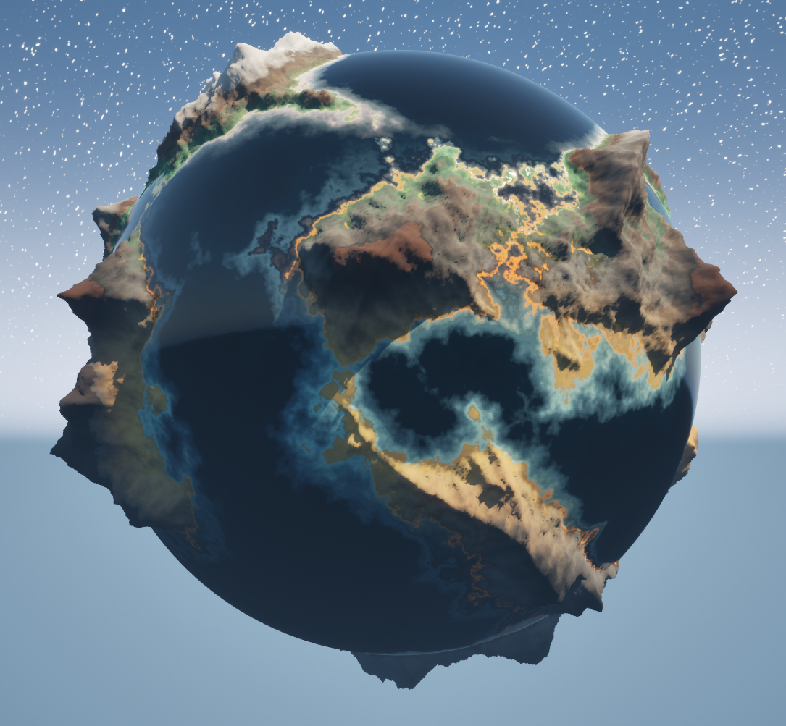

# ProcMeshSample
A collection of samples using the Procedural Mesh Component in Unreal Engine 5

## Sample 01 Simple Triangle

## Sample 02 Cube

## Sample 03 Line Mesh
Sample to create a mesh of lines.

## Sample 04 Terrain Generation
Sample using noise to generate terrain(planet).
